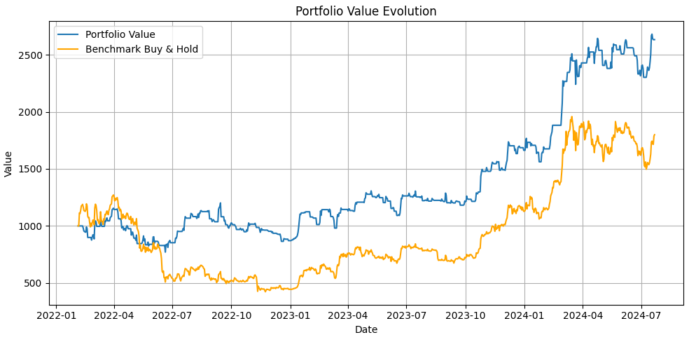
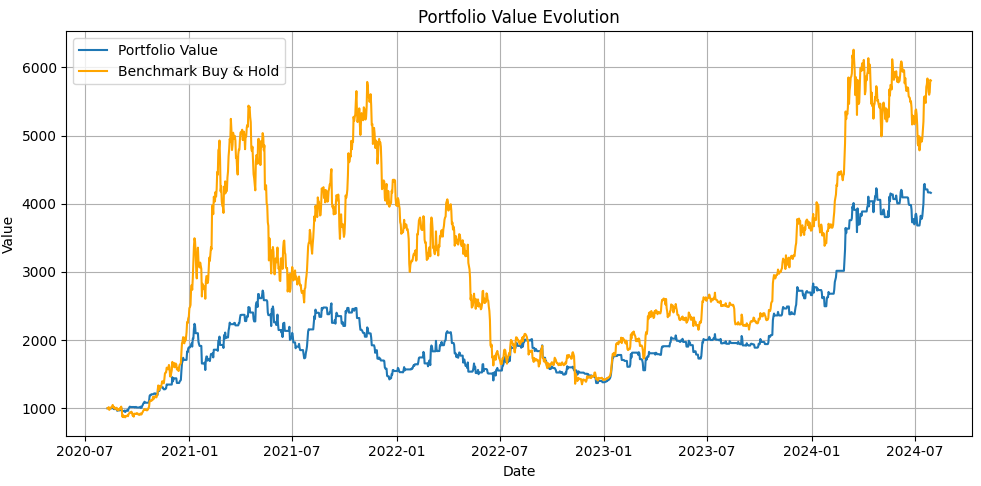
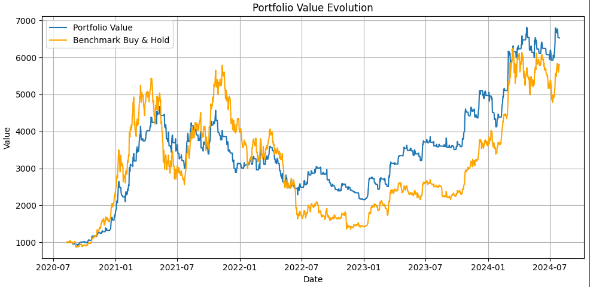
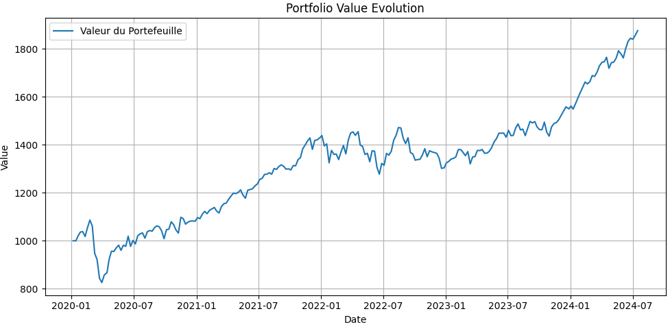

# Market Technical Analysis Lab 
This repo represent my data exploration regarding automated trading on bitcoin, stocks, and portfolio strategies, focusing on quite high timeframes (from daily to monthly).   
I tried a lot of different things (trying to prevent the overfitting as much as I could with walk-forward and co), when taking into account the fees, my conclusions are the following:
- One of the best strategy so far on the daily bitcoin is the hma cross. When the 6 hull moving average crosses up the 9 hull moving average, buy. If it crosses down, sell.

Even if I applied a walk forward strategy, we can see that depending on the size of the history we take and the parameter, this strategy is pretty weak. 6-9 parameters vs 5-12, for example:

- From a portfolio perspective, a pretty good allocation is the following: 20% gold, 80% stocks (MSCI World or even better S&P500). Each month, rebalance to keep the same proportions.   
The "All Weather" portfolio would suggest having cash and bonds, this tends to decrease the performance. Cash is going to 0 as long as we are printing from thin air, and I am not sure I have enough confidence in bonds nowadays.

*NB*: The code is not "production-grade", as it was only an exploratory project, and there may be some parts in french :)
